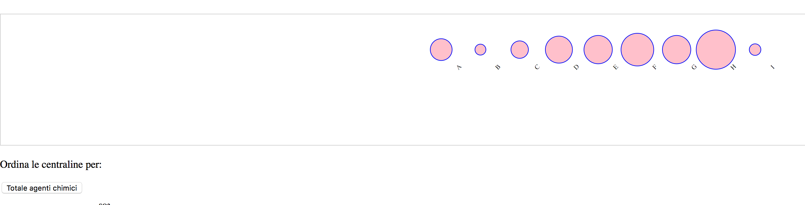
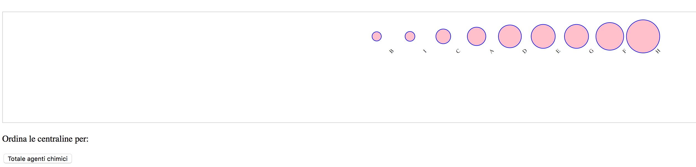
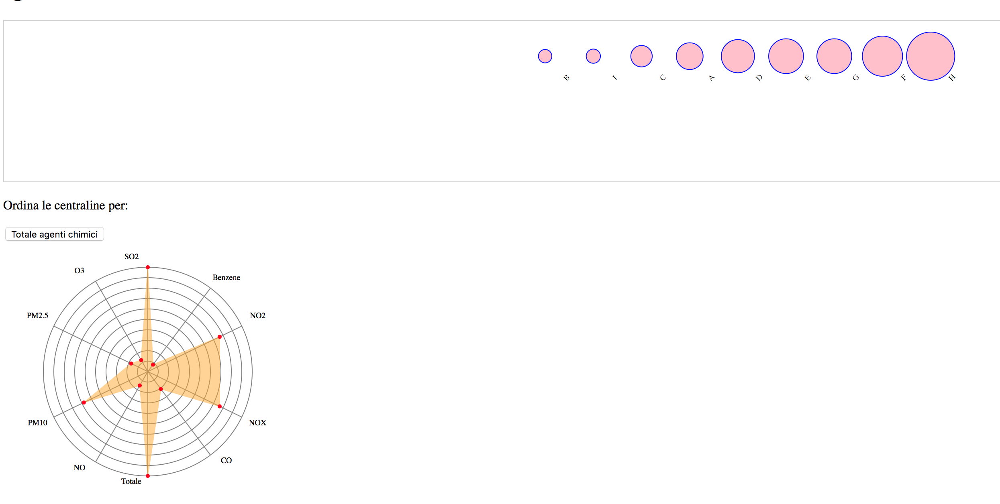
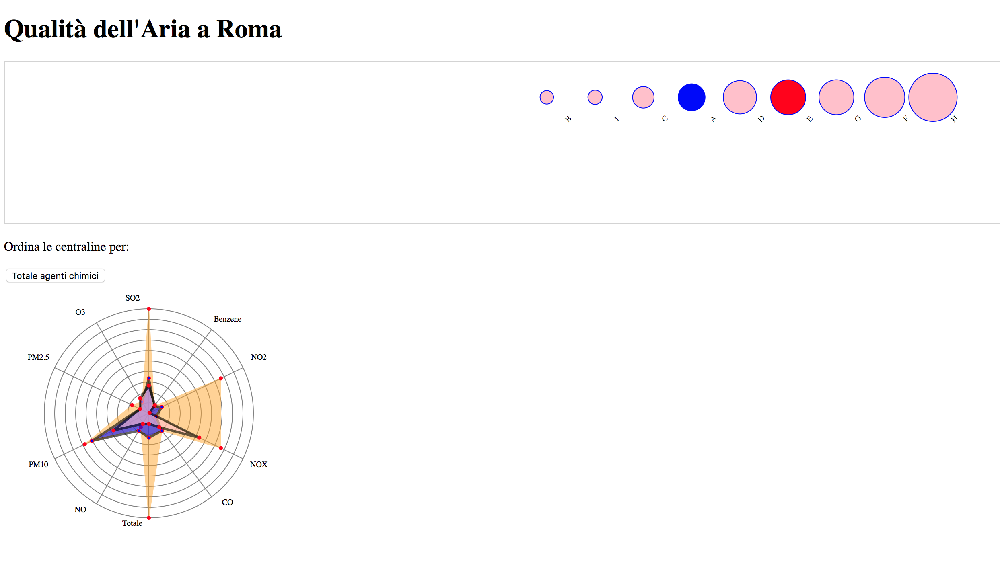
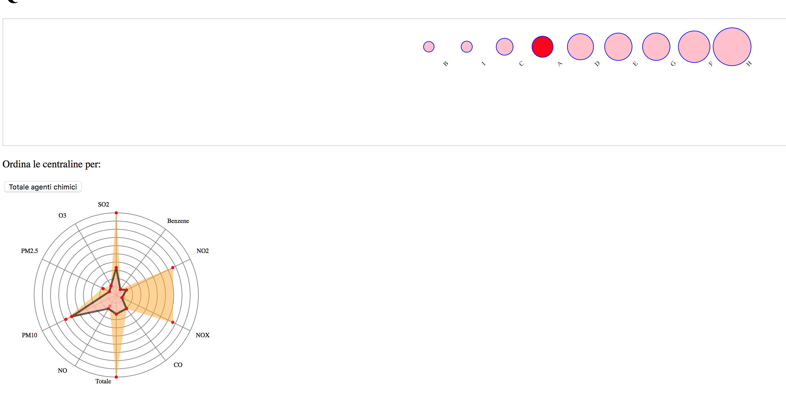

# QuAR: Qualità dell'Aria a Roma

Questa repository contiene il codice per lo sviluppo dell'applicazione sul moritoraggio della qualità dell'aria a Roma.

## Pipeline
Inserire figura che discrive il flusso dei dati

## Dati
Per ogni giorno dell'anno, a partire dal 2014, abbiamo le rilevazioni orarie delle stazioni localizzate da ARPA su Roma. Queste rilevazioni riguardano più agenti chimici:

* Benzene
* CO
* SO2
* ... etc

### Fonti
I dati cui si fa riferimento provengono da:

* ARPA Lazio 

	> Per ogni agente chimico mette a disposizione la serie storica giornaliera. Per automatizzare la pipeline si è sviluppato un mini crawler che scarica i dati in modo automatico.
 
* Open Data della Regione Lazio

	> Mette a disposizione un dataset che geolocalizza le stazioni da cui sono fatte le rilevazioni. Mancano le ultime inserite a seguito dell'ultimo aggiornamento del dataset. Sono stati aggiunti manualmente in accordo con la documentazione dei dati ARPA Lazio.
	
* Open Data Roma Capitale

	> Limiti imposti dalla legge [inserire decreti legge] per la concentrazione di agenti chimici nell'aria.

## Contenuto repository

## Applicazione

### Sketch Roadmap

#### Landing page

##### Screenshot

## Esecuzione

