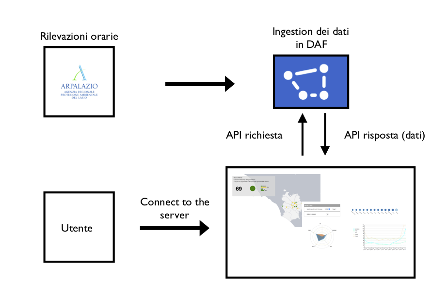
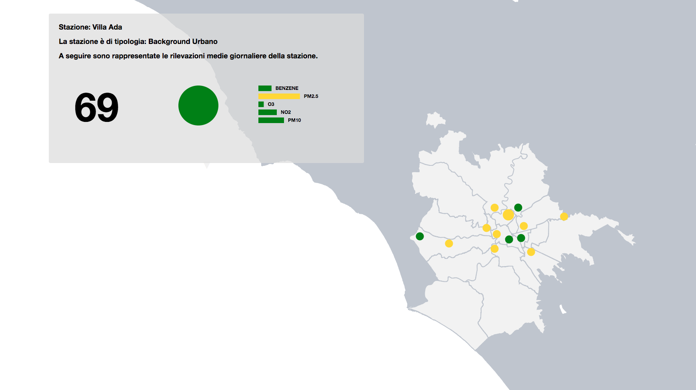
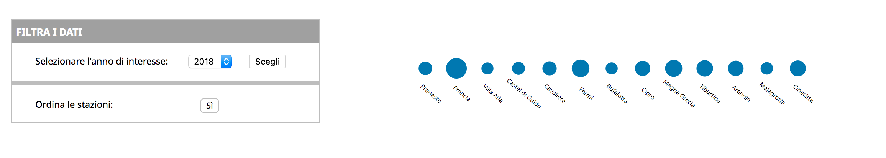
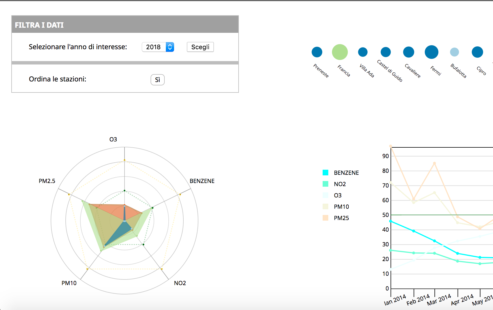
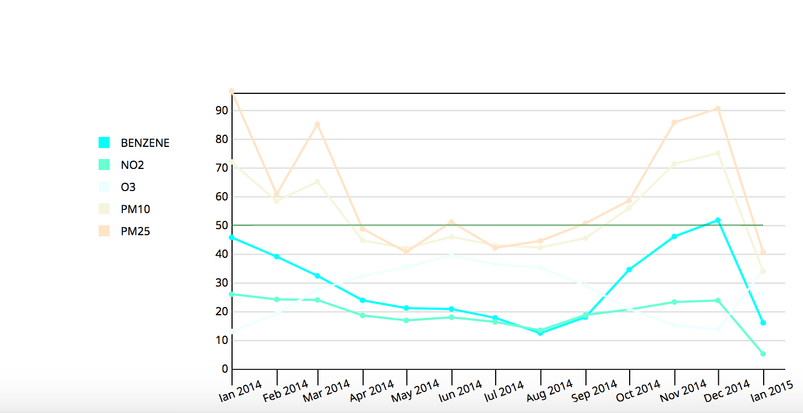

# QuAR: Qualità dell'Aria a Roma

Questa repository contiene il codice per lo sviluppo dell'applicazione sul moritoraggio della qualità dell'aria a Roma.

Il progetto, al momento Work In Progress è stato realizzato dal *Team per la Trasformazione Digitale* per il Roma Capitale. 

__@TODO__: inserire la ToC

## Pipeline [IT]
La figura seguente mostra il funzionamento dell'app in back end.



## Dati [IT]
Per ogni giorno dell'anno, a partire dal 1999, ARPA mette a disposizione le rilevazioni orarie delle stazioni per il controllo della qualità dell'aria situate a Roma. I dati sono forniti per 9 agenti chimici (o inquinanti). Per l'applicazione di pone l'attenzione su cinque di essi in quanto, solo per loro sono disponibili i valori limiti utili al calcolo dell'indice di qualità dell'aria. Gli inquinanti di interesse sono:

__N.B.__ questa parte verrà arricchita insieme al dipartimento ambiente del Comune. 

* Benzene
* NO2
* O3
* PM10
* PM2.5

I dati grezzi vengono ingeriti all'interno del DAF tramite il processo dettagliatamente descritto [qui](https://github.com/CriMenghini/daf-QuAR/tree/master/app/arpa_downloader). Il codice del download dei file è contenuto nei file:

* `main.py`
* `main_update.py`

### Fonti [IT]
Oltre i dati di ARPA si da riferimento a due ulteriori dataset:

* Open Data della Regione Lazio

	> Mette a disposizione un dataset che geolocalizza le stazioni da cui sono fatte le rilevazioni (`static/data/default_info/arpaaria.csv`). 	
* Open Data Roma Capitale

	> Limiti imposti dalla legge [inserire decreti legge] per la concentrazione di agenti chimici nell'aria.


## Applicazione [IT]

Utilizzando l'applicazione, il cittadino può ottenere informazioni relative alla qualità dell'aria nella sua zona. 

#### Visualizzazione su mappa [IT]
In particolare egli può visualizzare su mappa la disposizione delle centraline sul territorio cittadino. Per ogni centralina è inoltre possibile conoscere delle informazioni aggiuntive riguardo le rilevazioni di concentrazione degli inquinanti.


Nello specifico:

 - Il *colore* del cerchio che rappresenta la centralina corrisponde alla fascia dell'indice della qualità dell'aria (IQA)
 - Il *numero* sul tooltip, che si apre al passaggio del mouse sulla centralina, è il valore dell'IQA per quella centralina
 - Il *grafico a torta* indica la porzione di giorni dell'anno in cui la centralina ha un'aria positiva o negativa. La scala è fornita [qui - aggiungi link]
 - Il *grafico a barre* mostra la quantià di ogni inquinante. In particolare, il colore varia rispetto alla stessa scala fornita prima

#### Visualizzazione temporale [IT]
All'utente è data la possibilità di visualizzare i dati in un altro formato con l'intento di dargli la possibilità di comparare tra loro le stazioni.

- Per ogni centralina si costruisce una *bolla* la quale grandezza corrisponde all'IQA medio di tutti gli inquinanti registrato dalla centralina nell'anno di interesse. Per fargli un'idea migliore, all'utente è data la possibilità di ordinare le bolle.



- Passando il mouse sulle bolle è possibile vedere sulla mappa radar la quantità media di inquinante che la centralina ha rilevato nell'anno di interesse. Cliccando sulla centralina si blocca l'area corrispndente sul radar ed è possibile passare il mouse sulle altre centraline per adoperare un confronto. Per deselezionare le centraline bloccate occorre un __doppio click__! Sullo sfondo del radar:
	- L'area arancione mostra la media degli inquinanti su tutte le centraline
	- Le linee tratteggiate mostrano i range dell'IQA



- Infine è possibile visualizzare, facendo una media tra le varie centraline, le serie storiche mensili dei sincoli inquinanti. Anche questo grafico è interattivo in quanto da all'untente la possibilità di scegliere le serie da visualizzare.




## Esecuzione [IT]
Per eseguire l'applicazione è necessario clonare questa repository ed usare il branch `development`.

```
$ git clone https://github.com/CriMenghini/daf-QuAR.git
$ cd daf-QuAR
$ git checkout development
```

Quindi assicurarsi che tutti i requirements(`requirements.txt`) siano soddisfatti.


Per installare i requirements:

Con Conda:

```
$ while read requirement; do conda install --yes $requirement; done < requirements.txt
```
Senza:

```
$ pip install requirements.txt
```

Una volta verificati i requisiti:

```
$ python server.py <your_DAF_user> <your_DAF_psw> <daf_API_endpoint>
```

Once the server is ready open the page `0.0.0.0:5000` sul tuo browser.

## Contribuire [IT/EN]
__[IT]__
Il progetto è in via di sviluppo ed interamente disponibile in questa repository. Pertanto si incoraggia chiunque a partecipare alla sua completa realizzazione. Il codice non è complesso e documentato per quanto possibile, pertanto appetibile anche per i programmatori inesperti.

Il tipo di contribuzioni sono:

* `PROPOSAL`: l'utente propone una nuova feature per l'app
* `PATCH`: l'utente fixa dei bug
* `STYLE`: l'utente modifica colore e stile dell'app

Per coloro che vogliono contribuire si richiede di utilizzare le suddette label per identificare il tipo di `pull request`.


__[EN]__
This is a work in progress project. It is entirely open source thus everyone is invited to contribute!
The code is not difficult and documented as far as it's possible. So, newbies you are more than welcome!

The kind of contributions:

* `PROPOSAL`: the users proposes a new feature for the app
* `PATCH`: the user fixes bugs
* `STYLE`: the user modify the color, the style and the content of the app

To all those who wants to contribute, we kindly ask you to use the aforementioned labels such that we can identify the different typology of `pull requests`.


### Contenuto generale della repository [IT/EN]
__[IT]__ La repository è organizzata nel seguente modo:

* `shape_files`: raccoglie gli shape file utili alla generazione del topojson.

* `static`:
	* `css`: stylesheet per le pagine `html`
	* `data`: cartella contenente i dati utili
	* `js`: cartella contenente i file JS per le visualizzazioni
	* `src`: script per modificare e modellare i dati

__[EN]__ The repository is organized as follows:

* `shape_files`: raccoglie gli shape file utili alla generazione del topojson.

* `static`:
	* `css`: stylesheets for the `html` pages
	* `data`: folder that contains all the data
	* `js`: Javascript files for the viz (`d3`)
	* `src`: scripts to dynamically change data and viz

### Contenuto specifico [IT/EN]
__[IT]__ Se siete interessati a modificare:

*  la __mappa__ fare riferimento ai seguenti file:
	* `templates/mappa.html`: contiene html e JS per la visualizzazione della mappa
	* `static/css/style.css`: stile generale della pagina (header)
	*  `static/css/mappaStyle.css`: stile della mappa
	*  `static/src/utils.py`: linee 110-141 per l'elaborazione del topojson
			 
* le __bolle__ considerare i file:
	* `static/js/bubbleCentraline.js`: JS per la visualizzazione
	* `static/css/style.css`: stile 
	* `static/src/plot_utils.py`: la funzione `bubble_data ` modella i dati per la visualizzazione

* il __radar__ fare riferimento ai file:
	* `static/js/radarAgentiChimici.js`: JS per la visualizzazione
	* `static/css/style.css`: stile 
	* `static/src/radar_data.py`: la funzione `bubble_data ` modella i dati per la visualizzazione

* la __serie storica__ considera i file:
	* `static/js/lineAgentiChimici.js`: JS per la visualizzazione
	* `static/css/style.css`: stile 
	* `static/src/linee_data.py`: la funzione `bubble_data ` modella i dati per la visualizzazione 

__[EN]__ If you are interest in adding your contribution into:

*  the __map__ ftake a look here:
	* `templates/mappa.html`: html and JS to generate the map
	* `static/css/style.css`: general page style (header etc)
	* `static/css/mappaStyle.css`: mappa style
	*  `static/src/utils.py`: lines 110-141 to write the topojson			 
* the __bubbles__ take a look here:
	* `static/js/bubbleCentraline.js`: JS for the viz
	* `static/css/style.css`: style 
	* `static/src/plot_utils.py`: function `bubble_data ` to model data for the viz

* il __radar__ fare riferimento ai file:
	* `static/js/radarAgentiChimici.js`: JS for the viz	* `static/css/style.css`: style 
	* `static/src/plot_utils.py `: function `radar_data ` to model data for the viz


* la __serie storica__ considera i file:
	* `static/js/lineAgentiChimici.js`: JS for the viz	* `static/css/style.css`: style 
	* `static/src/plot_utils.py `: function `linee_data ` to model data for the viz
 


### Replicazione dell'app per altre amministrazioni [IT/EN]

__[IT]__ L'intento è quello di estendere l'applicazione alle altre città e regioni di Italia.

Il codice è generalizzato perciò, a meno di alcuni fattori:

* URL dell'API da cui sono estratti i dati
* Shape file geografici
* [fare un check di ciò che manca] 

è possibile replicare i risultati per la propria amministrazione utilizzando il seguente schema per i dati.

__@TODO__: DEFINIRE UFFICIALMENTE LO STANDARD

__[EN]__ Our aim is to extend the use of the app to public administations other than Rome.  The code has been generalized, but some factors:

* API endpoint to get data
* Shape files
* [check whatelse should be pointed out]

It is possible to reproduce the results for your own administration using the same schema for the data.

__@TODO__: OFFICIALLY DEFINE THE STANDARD

## Suggerire modifiche [IT/EN]

__[IT]__ Se non siete programmatori ma volete comunque dare il vosto contributo a questo progetto, andate nella sezione *Issue* ed apritene una in cui descrivete la modifica che vorreste fare e dategli una label seguendo quelle indicate [qui(aggiungi link sezione)]


